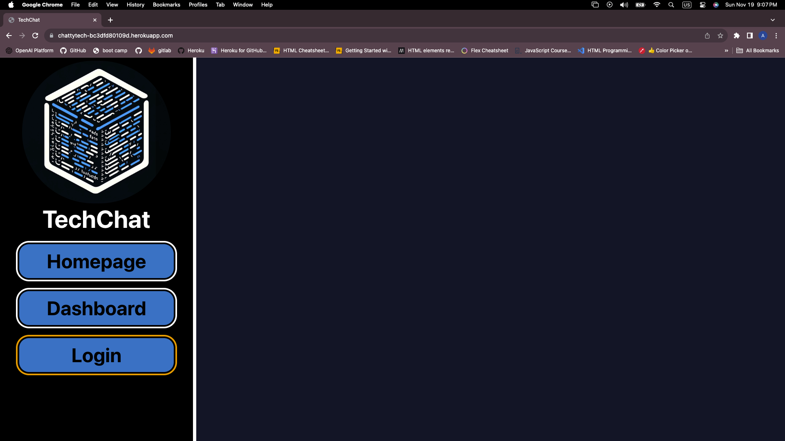

# 14 Tech Blog (<!>Constructuin in proceess<!>)

## Description
small chat room for the tech community !

## Table of Contents (Optional)
- [Installation](#installation)
- [Usage](#usage)
- [Credits](#credits)
- [License](#license)
- [Features](#Features)
- [Contribute](#Contribute)
- [License](#license)
- [Test](#Test)

## Installation
  "dependencies": {
    "bcrypt": "^5.0.0",
    "connect-session-sequelize": "^7.0.4",
    "dotenv": "^8.2.0",
    "express": "^4.17.1",
    "express-handlebars": "^5.2.0",
    "express-session": "^1.17.1",
    "mysql2": "^2.2.5",
    "sequelize": "^6.3.5",
    "sql": "^0.78.0"
  },
  "devDependencies": {
    "tailwindcss": "^3.3.5",
    "nodemon": "^2.0.3"
  }
## Usage

install the listed packages and run application  

## Credits
 * [Erick Hoverstine (tutor)](none)
 * [UCLA BOOTCAMP ACTIVITIES](ACTIVITIES 10 -26)
 * [bootcamp virtual assistant]

## License

## Features
User can lunch application with express, to run database. 

## Contribute
none

## Tests
none

## Questions
 Email: ayrh90@icloud.com
 GitHub: https://github.com/Ayrh1

